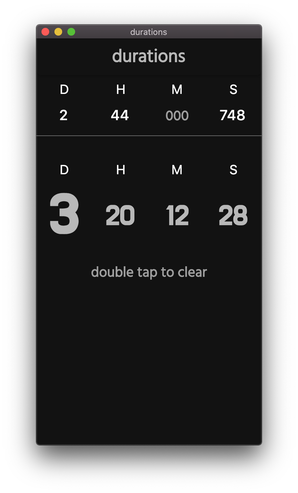
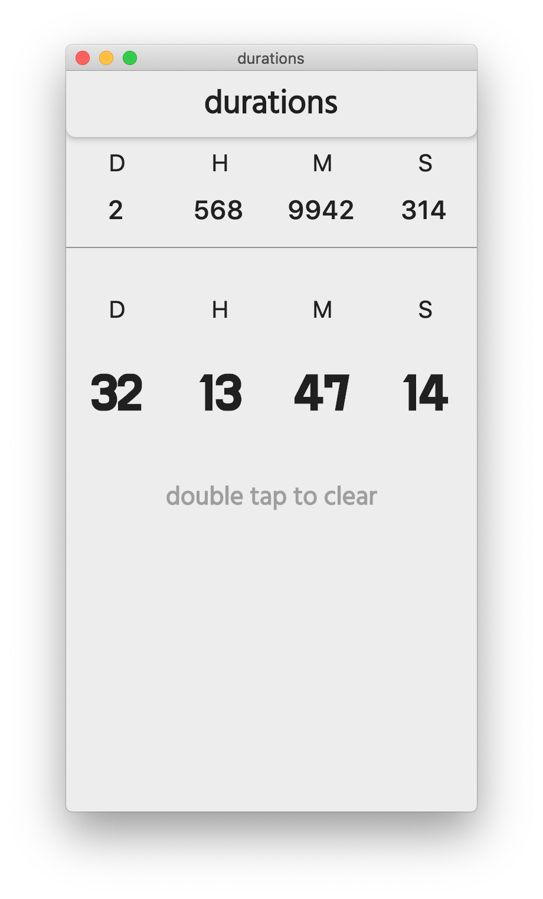

# durations ⏱

Duration niceifier.

## Takes a time input - eg, 748 seconds, 44 hours and 2 days - and transforms it into a logical format

## Automatic theme switching

Basically just a quick utility app made out of boredom.

*This project has some really bad coding practices.*